# Redfish firmware rollout

Firmware rollout for server BMCs over the standard [Redfish](https://www.dmtf.org/standards/redfish) API: a fleet
poller, a pre-flighted rollout in canary and waves, and a lab of ten emulated OpenBMC BMCs where the rollout really
updates firmware. Production is read-only; writes happen only in the lab.

## How the rollout works

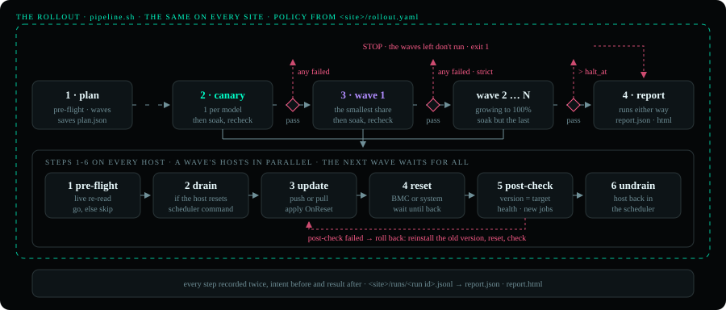

Each site is a folder, `lab/` or `prod/`, picked with `SITE=lab` or `SITE=prod`. Three files describe its fleet:
`inventory.yaml` (the BMCs, how to reach them, their rack, whether they are `writable`), `baseline.yaml` (the approved
version per model and component) and `images.yaml` (the image file and sha256 per version).

[pipeline.sh](pipeline.sh) runs the canary first, then wave by wave, with a gate after each:

1. **plan**: reads every BMC live and pre-flights it, then puts the hosts that pass in waves as the site's rollout
   policy says ([Rollout policy](#rollout-policy)): a canary of each hardware model, then waves that grow, spread
   across racks. It saves `plan.json`, and the later stages run exactly that plan.
2. **canary**: updates the canary hosts. Gate: any failure stops the pipeline, so wave 1 never starts.
3. **waves**: wave 1 starts only after the canary passed and soaked. After each wave, the gate: the first waves are
   strict like the canary (any failure stops the pipeline); later ones stop when more than `halt_at` of the hosts
   tried failed. A wave that passes soaks too, then its hosts are checked again before the next wave starts.
4. **report**: one report of the whole pipeline, from the plan and the run records (see [Reports](#reports)). It
   runs even after a stop; a stopped pipeline exits 1.

Every host, in the canary and in each wave, goes through six steps; the hosts of one wave run side by side:

1. **pre-flight** again, on a fresh read: the host may have changed since the plan.
2. **drain**, only when the reset restarts the host (BIOS, system firmware); a BMC reset leaves the host running.
3. **update**: multipart push of the image, or `SimpleUpdate` from a URL, applied on reset. The BMC runs it as a
   `Task` of its `TaskService`; every change of `TaskState`, `PercentComplete` and `Messages` is recorded, and the
   report shows the task, its messages and its progress under the step.
4. **reset**: `Manager.Reset` or `ComputerSystem.Reset`, graceful first, then wait until it answers again.
5. **post-check**: the target version runs, health is OK and no new job failed or stale.
6. **rollback**. When the post-check failed, roll back first: reinstall the version from before, reset, check
   again. A host that can't be rolled back stays drained and needs attention from a person in site(`needs_attention`).
7. **undrain**. If the post-check pass undrain the nodes - hosts.

Pre-flight gives each host **go**, **skip** (nothing to do, or busy: try a later wave) or **block** (a person has to
look), with every reason. It blocks a downgrade or a version order it can't tell (unless `--allow-downgrade`), a
component Redfish can't update (`Updateable` false, `WriteProtected`), a target below `LowestSupportedVersion`, a
missing image, a sha256 mismatch, an image over `MaxImageSizeBytes`, no rollback path (no A/B bank and no image of the
running version, unless `--accept-no-rollback`), a disabled update service, health not OK, and failed jobs.

Every step goes into `<site>/runs/<run id>.jsonl`, its intent before it and its result after, so a run stopped halfway
still shows where each host was. Each pipeline keeps its plan and reports in `<site>/runs/pipeline-<time>/`.

## What a run looks like

Every image here is a real run on the lab: its report, as `rollout.py report --svg` draws it from the pipeline's plan
and run records.

**An update of all ten BMCs**: the canary, then waves of 3 and 6, every gate passed.

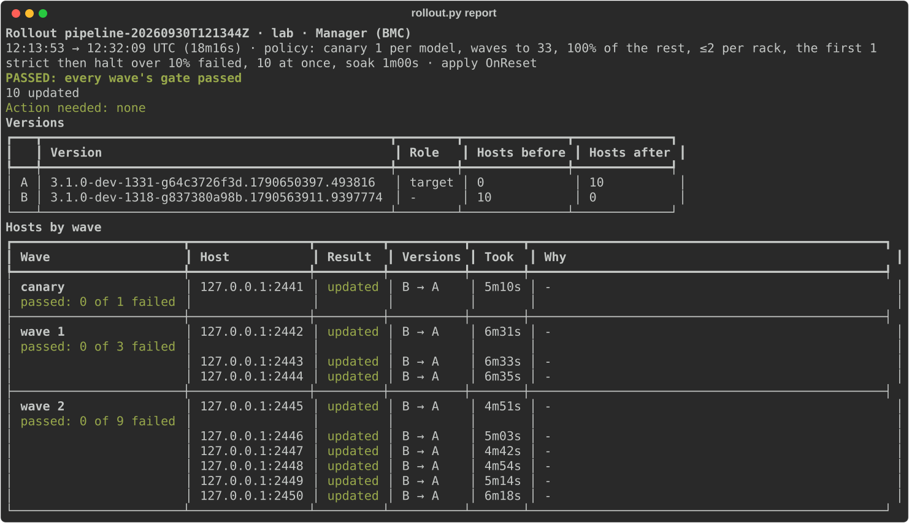

<details><summary>The terminal while it ran: every stage, and every step of every BMC as it happened</summary>

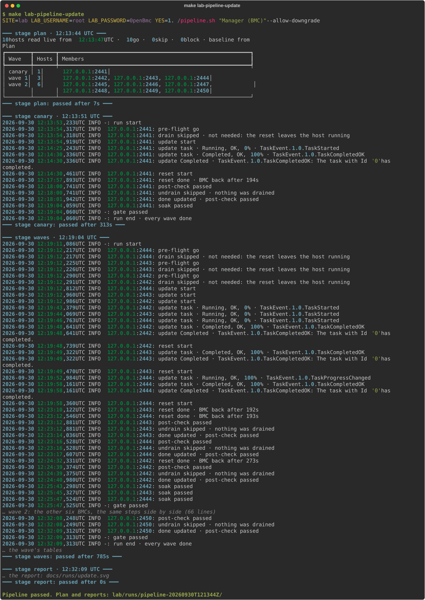

</details>

**A rollout that goes wrong** (`hybrid`): wave 1 has a good host, one whose new firmware fails its post-check and is
rolled back, and one whose BMC refuses the image. Wave 1 is strict, so the pipeline stops there and wave 2 never
starts. The other bad updates, one fault each, are under [Bad updates](#bad-updates).

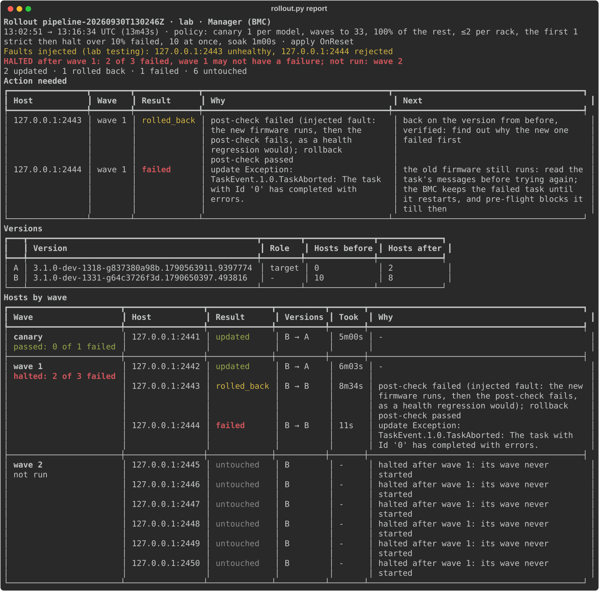

## Quick start: the lab

Needs Linux x86-64, Docker with Compose, Python 3.10+ and `curl`.

```sh
make setup                 # venv/ and requirements.txt
make lab-up                # downloads QEMU and two OpenBMC builds (~230 MB), boots 10 BMCs (~7 min)
make lab-pipeline-plan     # dry run: plan, canary, waves; nothing is written
make lab-pipeline-update   # the rollout: a canary of 1 BMC, then waves of 3 and 6
make lab-pipeline-report   # the verdict, what needs a person, every host by wave (HOST=… for its steps)
make lab-reset             # stop the BMCs and wipe their flash: they boot the older build again
```

`make help` lists every target and the variables it takes. To roll the lab back, swap the commented line in
`lab/baseline.yaml` and run `make lab-pipeline-update` again.

## The lab stack

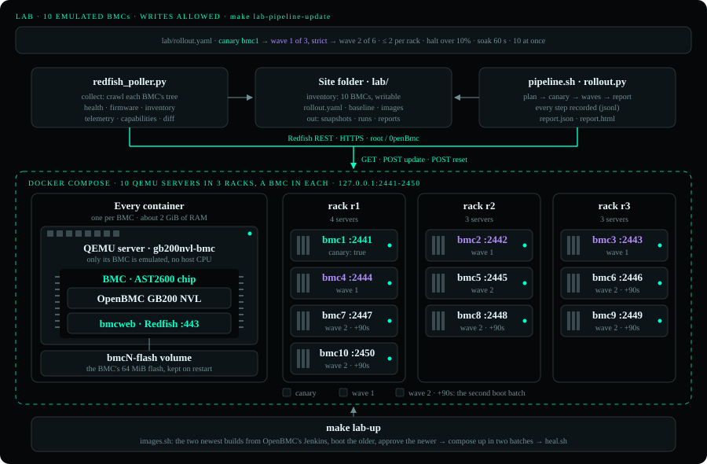

Each lab BMC is four layers in one Docker container ([lab/](lab/)):

| Layer | What it is |
|---|---|
| Docker | [lab/Dockerfile](lab/Dockerfile): Debian slim with QEMU and the flash image. [Compose](lab/compose.yaml) runs ten, `bmc1` to `bmc10` (about 2 GiB of RAM each), each with its own flash volume, so an update survives a restart. Healthy once `/redfish/v1` answers. |
| QEMU | OpenBMC's prebuilt `qemu-system-arm` with the `gb200nvl-bmc` machine: a full emulation of the BMC's own computer, the ASPEED AST2600 chip with its ARM cores, RAM, SPI flash and NIC. Only the BMC is emulated; there is no Grace CPU or Blackwell GPU behind it, so the lab updates the BMC's own firmware. |
| OpenBMC | The GB200 NVL build (`gb200nvl-obmc`) from OpenBMC's Jenkins: Linux, D-Bus and the phosphor services, booted from a 64 MiB flash image. |
| bmcweb | Redfish on the BMC's port 443. QEMU forwards it to the container, and Compose publishes it on `127.0.0.1:2441-2450` (SSH on `2221-2230`). Login `root` / `0penBmc`, OpenBMC's public default. |

`make lab-up` runs [lab/images.sh](lab/images.sh), which fetches the two newest GB200 NVL builds (Jenkins keeps only
the last three, so no build can be pinned). The lab boots the older one and `lab/baseline.yaml` approves the newer, so
the first rollout is a real update. Both update packages go into `lab/images.yaml` with their sha256.

Ten emulated BMCs booting at once starve each other of CPU, so they boot in two batches (`bmc6` to `bmc10` 90 s later).
Even so, a service now and then runs before `/dev/mtd/u-boot-env` exists: systemd ends degraded, and bmcweb reports
the Manager `Quiesced`, health `Critical`. `make lab-up` then restarts that BMC ([lab/heal.sh](lab/heal.sh)); pre-flight
would block it, as it would a real one.

## Reports

Every pipeline that changed something, or stopped, leaves one report in `<site>/runs/pipeline-<time>/`, built from
its plan and its run records. It comes in two forms, drawn from the same data so they can't disagree:

- **`report.json`**, for services (schema `rollout-report/1`). Top level: `result` (`passed`, `halted`, `blocked`,
  `incomplete`, `nothing to do`), `stopped` (the wave, `failed` of `tried`, the limit, the waves not run), `totals`
  per host state, `fleet` (hosts per version, `before` and `after`), `action_needed`, `waves` and `left_out`
  (hosts the plan didn't take, with why). Each wave has its `gate` (`passed`, `halted`, `not run`) and its hosts;
  each host its `state`, `before`, `target` and `after` versions, `identity` (the Redfish service's `UUID`, a
  serial number where reported), `why`, `next` and its `steps`: the pre-flight `checks` (every check made, each
  `{check, ok, detail}`), the update's `method` (`push` to `MultipartHttpPushUri`, or `pull` with
  `SimpleUpdate`), `uri`, `image` (file and sha256) and `task` (URI, `TaskState`, `TaskStatus`, `PercentComplete`,
  every message by `MessageId`) with its `progress`, the reset's `action`, `reset_type` and `resource`, the
  post-check's `checks`, and a rollback's `reason`, `to` and `verified`. Times are UTC ISO 8601, durations in
  seconds, states are fixed words; the text is only ever next to them.
- **The report for people**, in the terminal and as `report.html`: the verdict first, then what needs a person
  (host, why, next step), the versions (a letter each, with hosts before and after), and every host by wave with
  the wave's gate. `report.html` adds every host's steps with their evidence. `make lab-pipeline-report` shows the
  latest pipeline's; `HOST=127.0.0.1:2443` shows one host's steps.

<details><summary>One host's steps with their evidence: the canary of <code>unhealthy</code></summary>

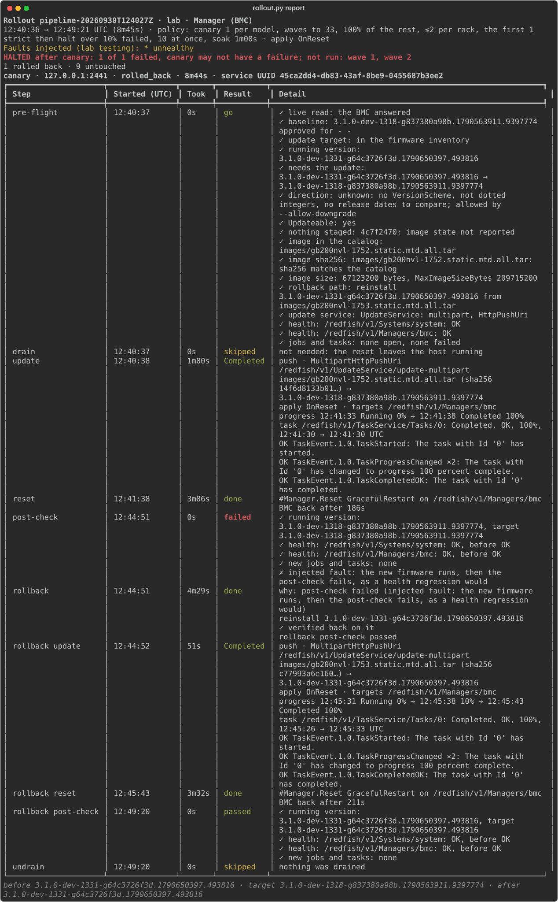

</details>

## Bad updates

`make lab-pipeline-fault SCENARIO=<name>` runs the real pipeline to the build the lab doesn't run, with faults
injected where real ones would show (`rollout.py run --fault [HOST=]KIND`, lab only; [lab/scenario.sh](lab/scenario.sh)).
Every scenario should stop the pipeline at a gate; the script checks how each host ended. The single-fault scenarios
hit every host, so the canary fails and the waves never run:

| Scenario | The bad update | What the rollout does | Canary ends |
|---|---|---|---|
| `silent-fail` | The BMC takes the image and reports `Completed`, but the firmware doesn't change: it got the running version's package as the target's | post-check ✗ → reinstall the version before → post-check ✓ | `rolled_back` |
| `unhealthy` | The new firmware flashes and boots, then fails the post-check (`--fault unhealthy`, where a health regression would show) | a real rollback: reflash the version before, check again | `rolled_back` |
| `rejected` | The BMC refuses the image (the payload is cut to 8 MiB on its way): its task ends in `Exception` | no reset, the old firmware still runs: nothing to roll back | `failed` |
| `bad-checksum` | The file doesn't match the catalog's sha256 | pre-flight blocks every host; the plan stage fails | `blocked` |
| `no-return` | The BMC isn't back within the reset timeout (45 s; a boot takes ~3 min) | the rollback reinstalls the version before, but its reset times out too: nothing verified, left for a person | `needs_attention` |

<details><summary>The report of <code>silent-fail</code></summary>

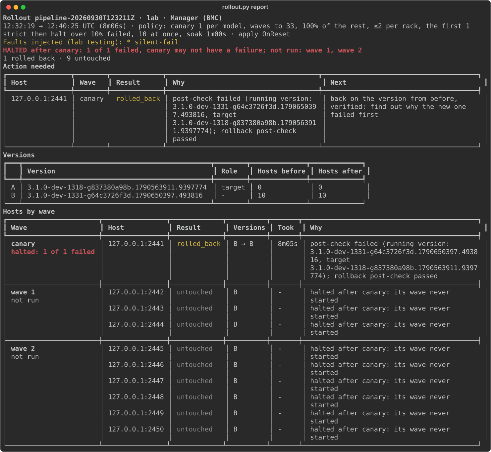

</details>
<details><summary>The report of <code>unhealthy</code></summary>

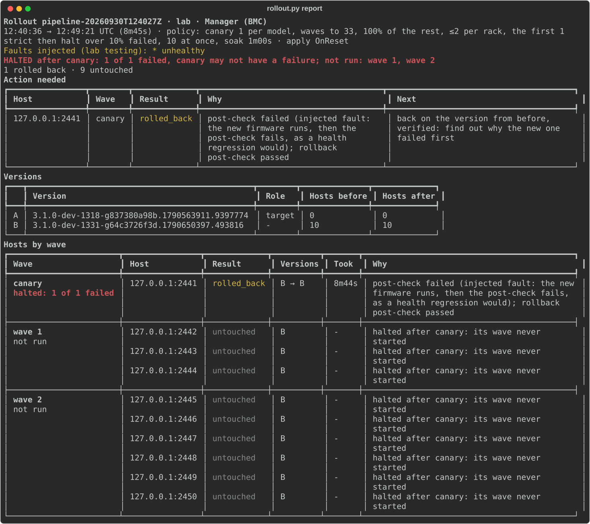

</details>
<details><summary>The report of <code>rejected</code></summary>

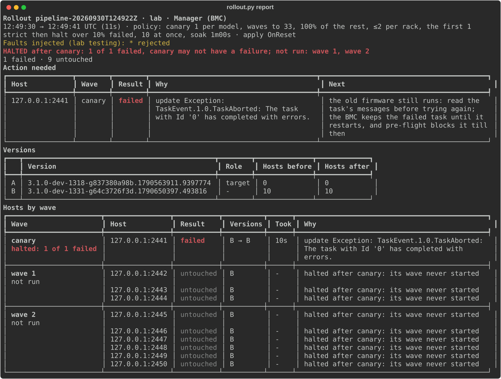

</details>
<details><summary>The report of <code>bad-checksum</code></summary>

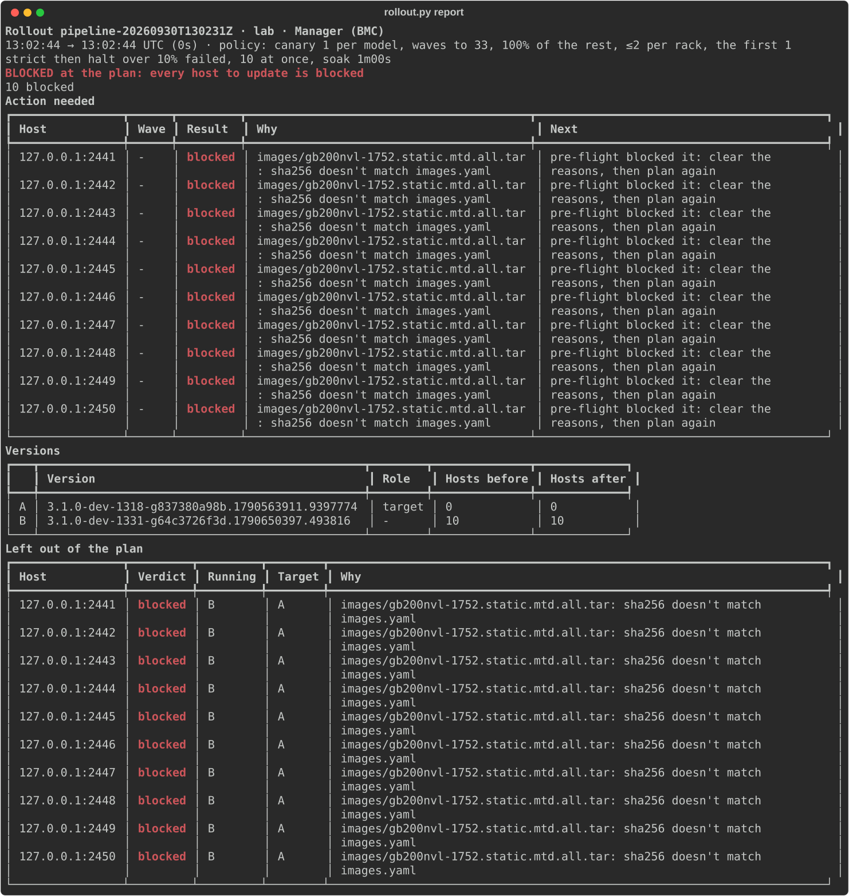

</details>
<details><summary>The report of <code>no-return</code></summary>

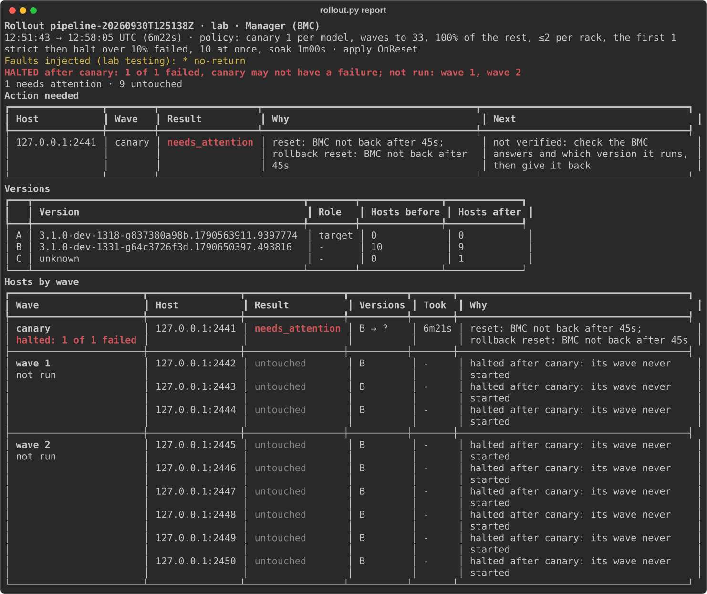

</details>

`hybrid` mixes good and bad updates in one rollout, the way a real one goes wrong:

| Wave | Hosts | Fault | Ends |
|---|---|---|---|
| canary | 2441 | none | `updated`, then soaked |
| wave 1 | 2442 | none | `updated` |
| wave 1 | 2443 | `unhealthy` | `rolled_back` |
| wave 1 | 2444 | `rejected` | `failed` |
| wave 2 | 2445 to 2450 | - | untouched: wave 1 is strict, and 2 of its 3 hosts failed |

The canary can't catch a fault that hits only some hosts; the halt after each wave is what stops it spreading. The
fleet is left on two builds, and the report says which host is where.

`make lab-pipeline-report` then shows the run: what needs a person, and each host's versions before and after.

After `rejected`, the aborted task stays in that BMC's `TaskService`: bmcweb keeps tasks until the BMC restarts and
only allows GET on them. Pre-flight then blocks the BMC (a failed task: a person has to look), so the next plan picks
another canary. `docker compose -f lab/compose.yaml restart bmc1` clears it, as a BMC reset would.

## Rollout policy

Each site has a `rollout.yaml` next to its inventory and baseline. `plan` and `run` read it, an option overrides one
value for one run (`--canary`, `--waves`, `--max-per-rack`, `--halt-at`), and the plan and the report record what was
used. It is reviewed like code: it decides how many hosts a bad image can reach before something stops it.

| Setting | [lab](lab/rollout.yaml) | [production](prod/rollout.yaml) | What it does |
|---|---|---|---|
| `canary_per_model` | 1 | 1 | Hosts of each hardware model that go first. A bad image is almost always model-specific, so one canary for the whole fleet proves nothing for the other models. Hosts marked `canary: true` in the inventory go first. |
| `waves` | 33, 100 | 5, 25, 100 | Cumulative % of the other hosts done after each wave: small while the evidence is thin, bigger once gates have passed. |
| `max_per_rack` | 2 | 1 | Hosts of one rack in the same wave, at most: a rack never loses more nodes than it can spare. The rest wait for a later wave, so it also caps a wave's size: 1,000 hosts in 100 racks at 1 per rack take 11 waves after the canary (50, then up to 100 each); at 2 per rack, 6. |
| `strict_waves` | 1 | 1 | The first waves after the canary that halt on any failure, as the canary does. |
| `halt_at` | 10% | 2% | Later waves stop when more than this share of the hosts tried failed. 10% of 1,000 would be 100 broken BMCs. |
| `max_parallel` | 10 | 50 | Updates running at once within a wave: the BMCs and the image server set the limit. |
| `soak` | 60 s | 30 min | After a wave, wait, then check its hosts again before the next wave: some faults show only after a while. |

With the lab's 10 BMCs in 3 racks: canary 2441 (fw image), wave 1 of 3 (one per rack), wave 2 of 6 (two per rack).

## Approach in production IT Equipment

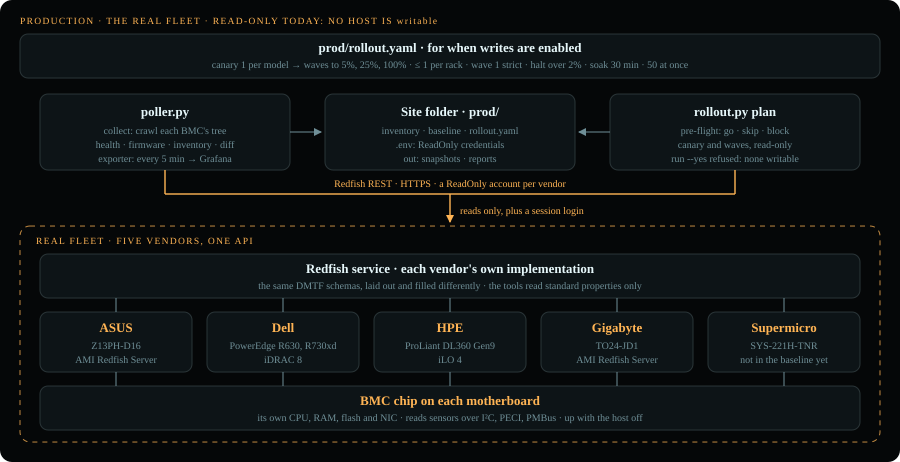

Equipment running production services runs the same tools, the same pipeline and the same six steps with `SITE=prod`; only the inventory, the credentials and the policy change.

The operations in these systems -**ASUS**, **HPE**, **Supermicro**, **DELL**- are **read-only**: `make prod-collect`, the views (`make prod-health`, `prod-firmware`...) and
`make prod-plan`.

[prod/inventory.example.yaml](prod/inventory.example.yaml)

```yaml
# prod/inventory.yaml
defaults: {scheme: https, verify: false}
servers:
  - {host: 10.0.0.5, vendor: Dell, project: cluster-a, rack: r1,
     username_env: DELL_REDFISH_USERNAME, password_env: DELL_REDFISH_PASSWORD}
```

```sh
# prod/.env, read by make
DELL_REDFISH_USERNAME=...
DELL_REDFISH_PASSWORD=...
```

How a production rollout is built, from the whole fleet down to one host:

1. **Rings, one at a time.** The lab's emulated BMCs first, then internal or spare nodes, then production region by
   region. A bad image that reaches every region at once can't be contained; the same pipeline runs at each ring.
2. **One component per pipeline**, in rollout order: the BMC first (it carries the other updates), then BIOS, then the
   rest. The baseline says the target per hardware model, and the catalog has the image for each.
3. **Group by what fails together.** The canary covers every hardware model the update touches, because firmware
   faults follow the model. Each wave spreads across racks, PDUs and InfiniBand pods, with at most `max_per_rack`
   hosts of one rack in a wave, so no rack or pod loses more capacity than it can spare. Idle and spare nodes go
   first; the scheduler drains busy ones (`--drain`) before a reset that restarts the host.
4. **Waves that grow, gates that start strict**, as [the rollout](#how-the-rollout-works) does everywhere, with
   production's policy: canary, then 5%, 25% and the rest; the first wave strict, later ones halting over 2%; 30
   minutes of soak between waves.
5. **Evidence.** The plan, the run records and the report in `prod/runs/` are the change's record: `report.json` for
   the services that track fleet state, the report for the people who approve the next ring.

To run it:

- **Accounts**: keep the poller on a ReadOnly role. Give the rollout its own account whose role can update firmware
  and reset the BMC (`ConfigureComponents` and `ConfigureManager`, Administrator on most BMCs).
- **Scope**: mark hosts `writable: true` only for the change window, give each its `rack`, and mark a few
  representative spare hosts per model `canary: true`.
- **Drain**: pass the scheduler's commands, e.g. `--drain "scontrol update NodeName={node} State=DRAIN Reason=firmware"`
  and `--undrain "scontrol update NodeName={node} State=RESUME"`. They run only when the reset restarts the host.
- **Images**: the vendor packages in `prod/images.yaml` with their sha256, and the packages of the versions running
  now, so every host has a way back. For a large fleet, serve them from a regional HTTPS mirror and list the URL: the
  BMCs pull them with `SimpleUpdate` instead of one machine pushing to each.
- **Run**: with `prod/.env` exported, `SITE=prod ./pipeline.sh "Manager (BMC)"` is the dry run and `YES=1` updates.
  It runs from an admin host on the BMC management network.

---
## Not built yet
- Rolling back by switching to the other A/B bank (a host that would need it stays drained as
`needs_attention`.
- Rolling out ring by ring or region by region.

### A production system - scaling for a large fleet

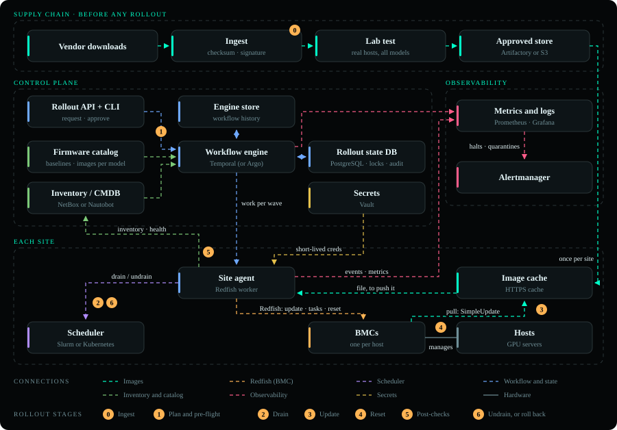

At fleet scale the rollout becomes a distributed system. The figure is the target, in four parts:

- **Supply chain**: a vendor image is downloaded, its checksum and signature checked, tested on lab hosts of every
  model, then promoted into an approved store (Artifactory or S3).
- **Control plane**: an operator requests a rollout through an API and CLI, and approves the canary. A workflow engine
  (Argo or Temporal) reads the firmware catalog (the **baseline** per model) and the inventory (Nautobot), pre-flights,
  plans the canary and waves, and applies the gates. A rollout state database (PostgreSQL) holds each host's state and
  wave, a lock per host so two rollouts never touch the same host, and an append-only audit trail; a gate is a query on
  it. 
- DB for storing the state of hosts after a failed stage.
- **Each site**: a site agent on the management network takes the work of each wave, gets short-lived BMC credentials
  from Vault, drains hosts through the scheduler (Slurm or Kubernetes) and drives the update over Redfish. The BMCs
  pull the image from a cache in their site, so each file crosses the WAN once per site.
- **Observability**: the agents and the engine send events and metrics (Prometheus, Grafana); a halt or a quarantined
  host pages someone.

The numbered badges are the rollout's steps where they happen: 0 is ingest, before any rollout; 1 to 6 are the steps
every host goes through, as in [the rollout](#how-the-rollout-works). The BMC stays the only truth about what runs:
the database records intent and observations, and a host is read again over Redfish before anything acts on it.

How this repository maps onto it:

| In the system | In this repository today | Next |
|---|---|---|
| Approved store, site cache | `images.yaml`: a file or URL per version, with its sha256, which pre-flight checks for a file | serve images from a site HTTPS cache: `rollout.py` already hands a URL over with `SimpleUpdate` (the lab exercises push) |
| Firmware catalog | `baseline.yaml` and `images.yaml`, reviewed in git | the same |
| Inventory / CMDB | `inventory.yaml`; the poller's snapshots are the observed versions, and `make prod-firmware` shows drift from the baseline | generate the inventory from Nautobot |
| Rollout API and CLI | the `make` targets and `pipeline.sh`; `YES=1` is the approval | an approval between the canary and wave 1 |
| Workflow engine | `pipeline.sh`'s stages and `rollout.py run`: waves, gates, soak | a service that resumes a stopped rollout |
| Rollout state DB | `<site>/runs/*.jsonl`: every step's intent before it and result after it; `report.json` | PostgreSQL, with host locks and the gate as a query |
| Engine store | none: a rerun plans again, and pre-flight skips the hosts already on the target | the engine's own |
| Site agent | `rollout.py run` on an admin host on the management network | one per site |
| Scheduler | the `--drain` and `--undrain` commands | the same |
| Secrets | `prod/.env`, git-ignored | Vault, short-lived credentials |
| Observability | the report: terminal, HTML and `report.json` | metrics, and alerts on a halt |


## Layout

```
Makefile            every command: make help
pipeline.sh         plan → canary → waves → report
redfish_poller.py   collect, then the views: health, firmware, inventory, telemetry, capabilities, diff
rollout.py          plan, run, report
test_rollout.py     checks of the wave plan: python test_rollout.py
constants.py        what to crawl, table columns, rollout constants
helpers.py          shared helpers
schemas/            DMTF Redfish JSON Schemas for sensor units, downloaded on first use (git-ignored)
lab/                the emulated BMCs: Dockerfile, compose.yaml, images.sh, heal.sh, scenario.sh, inventory.yaml,
                    rollout.yaml
prod/               the real fleet: baseline.yaml, rollout.yaml; inventory.yaml and .env stay local
docs/               diagrams: the rollout, the lab, production today, a production system
docs/runs/          reports of real lab runs: the update and every bad-update scenario
```
