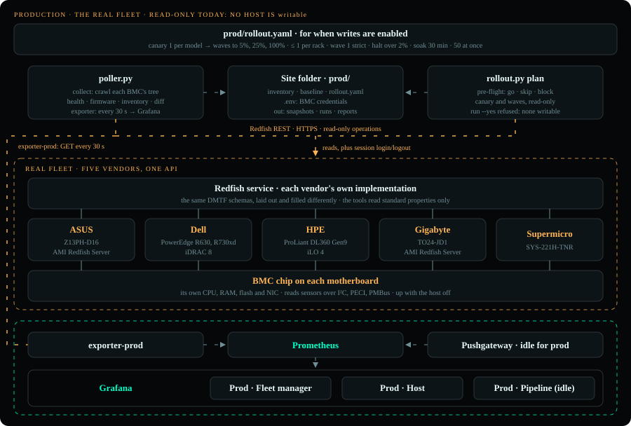
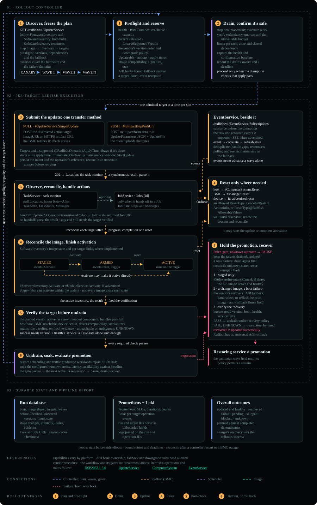
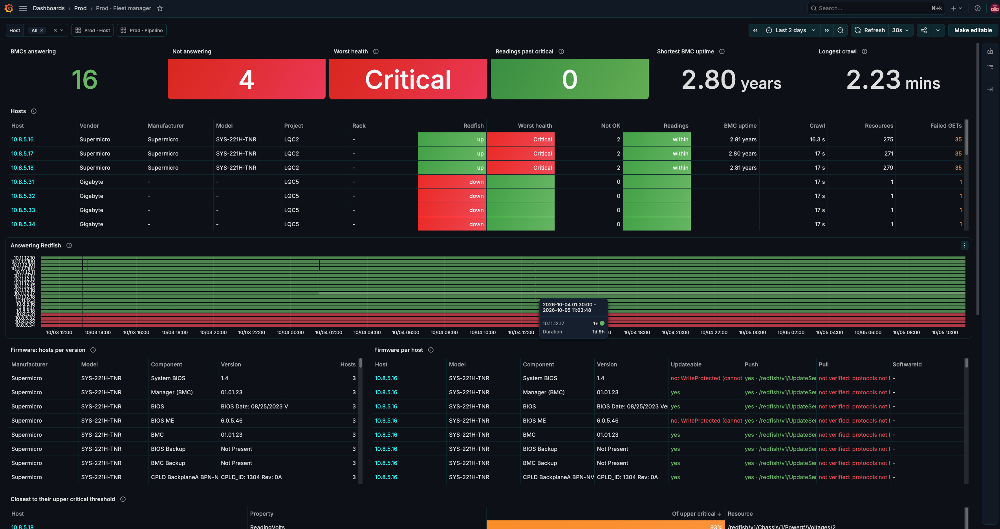
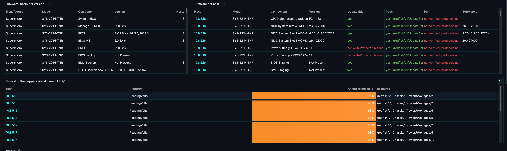
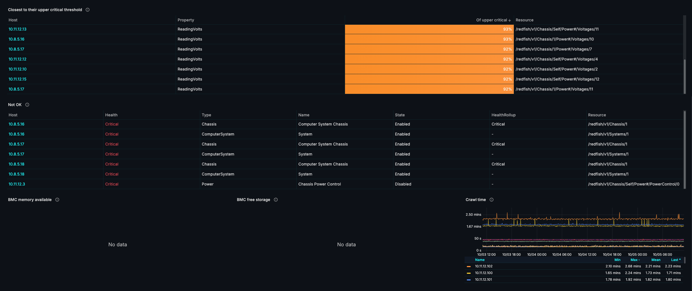
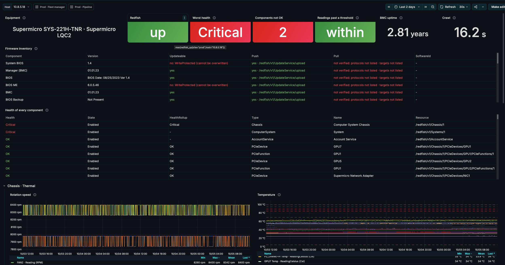
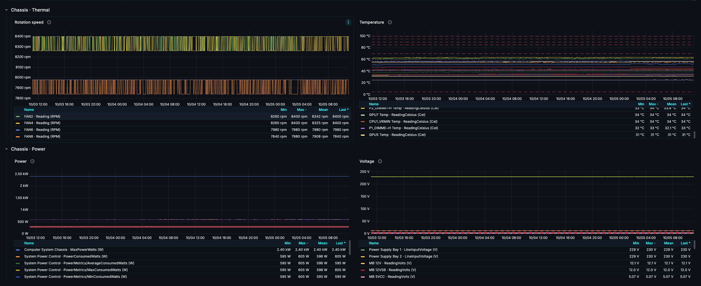
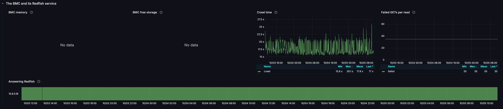
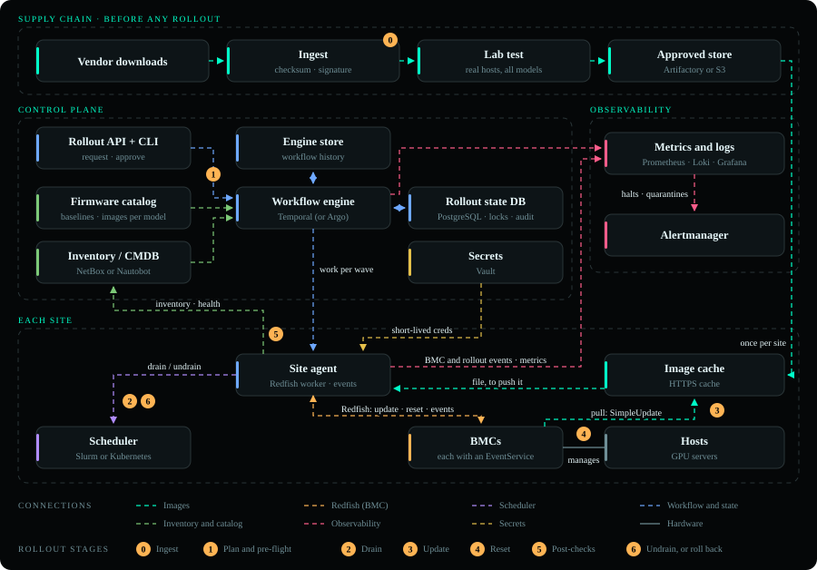

# Production

The real fleet, ASUS, Dell, HPE, Gigabyte and Supermicro, has only been read: collects, plans, dry runs and the
exporter, never an update. This page covers how a production rollout is built and run, the update as Redfish
resources, the fleet in Grafana, and the system the rollout grows into at fleet scale, with how this repository
maps onto it. Every update so far ran on [the lab](lab.md); the rollout itself is in the [README](../README.md).

## Approach in production IT Equipment



Equipment running production services runs the same tools, the same pipeline and the same six steps with `SITE=prod`; only the inventory, the credentials and the policy change.

Production (**ASUS**, **Dell**, **HPE**, **Gigabyte**, **Supermicro**) has been used **read-only**: `make collect SITE=prod`, the views (`make health SITE=prod`, `make firmware SITE=prod`...), `make plan SITE=prod`, `make dry-run SITE=prod`, and `exporter-prod`, every 5 minutes. They read only, plus a Redfish session login and logout. `make update` and `make fault` refuse `SITE=prod`, and no production host is marked `writable`. The runner underneath can write: `rollout.py run --yes` updates a host the inventory marks `writable: true`, which is how a change window would run ([To run it](#to-run-it)). The Supermicro has no row in `prod/baseline.yaml` yet, so the plan skips it as not in the baseline.

[prod/inventory.example.yaml](../prod/inventory.example.yaml)

```yaml
# prod/inventory.yaml
defaults: {scheme: https, verify: false}
servers:
  - {host: 10.0.0.5, vendor: Dell, project: cluster-a, rack: r1,
     username_env: DELL_REDFISH_USERNAME, password_env: DELL_REDFISH_PASSWORD}
```

```sh
# prod/.env, read by make
DELL_REDFISH_USERNAME=...
DELL_REDFISH_PASSWORD=...
```

How a production rollout is built, from the whole fleet down to one host:

1. **Rings, one at a time.** The lab's emulated BMCs first, then internal or spare nodes, then production region by
   region. A bad image that reaches every region at once can't be contained; the same pipeline runs at each ring.
2. **One component per pipeline**, in rollout order: the BMC first (it carries the other updates), then BIOS, then the
   rest. The baseline says the target per hardware model, and the catalog has the image for each.
3. **Group by what fails together.** The canary covers every hardware model the update touches, because firmware
   faults follow the model. Each wave spreads across racks, with at most `max_per_rack` hosts of one rack in a wave,
   so no rack loses more capacity than it can spare; PDUs and InfiniBand pods need the same limit, which isn't built.
   Idle and spare nodes go first; the scheduler drains busy ones before a reset that restarts the host.
4. **Waves that grow, gates that start strict**, as [the rollout](../README.md#how-the-rollout-works) does everywhere, with
   production's policy: canary, then 5%, 25% and the rest; the first wave strict, later ones halting over 2%; 30
   minutes of soak between waves.
5. **Evidence.** The plan, the run records and the report in `prod/runs/` are the change's record: `report.json` for
   the services that track fleet state, the report for the people who approve the next ring.

### To run it

- **Accounts**: keep the poller on a ReadOnly role. Give the rollout its own account whose role can update firmware
  and reset the BMC (`ConfigureComponents` and `ConfigureManager`, Administrator on most BMCs).
- **Scope**: mark hosts `writable: true` only for the change window, give each its `rack`, and mark a few
  representative spare hosts per model `canary: true`.
- **Drain**: set `drain` and `undrain` in `prod/rollout.yaml`, the scheduler's commands with `{node}`; the file has
  a Slurm example. The drain must wait until the node is empty, not just stop new jobs. Without it, pre-flight
  blocks every update whose reset restarts the host (BIOS, system firmware); a BMC update needs none.
- **Images**: the vendor packages in `prod/images.yaml` with their sha256, and the packages of the versions running
  now, so every host has a way back. Serve them from the site's HTTPS cache and set `IMAGE_CACHE` to its address, as
  the lab does: `images.yaml`'s files become paths in it, and the rollout fetches, checks and pushes each one. A BMC
  that offers `SimpleUpdate` with the URL's protocol and target allowed can pull instead, given the image's full URL.
  The plan's Push and Pull columns show which, per resource, and pre-flight blocks a host whose method the BMC
  doesn't allow.
- **Run**: `make dry-run SITE=prod` is the dry run. The update itself, once hosts are `writable`, is
  `SITE=prod YES=1 ./pipeline.sh "Manager (BMC)"` with `prod/.env` exported, from an admin host: the Makefile never writes
  to production. The plan is the approval: its stages refuse to run when an input file changed since, and block a host
  whose BMC isn't the one the plan read.

## The update, resource by resource

The same update in production, as Redfish resources, with every flow a production BMC may need;
[Not built yet](../README.md#not-built-yet) lists what the rollout doesn't do yet.



## The production fleet in Grafana

The Prod folder over two days of the real fleet, read-only. The fleet manager shows which BMCs answer, their health,
equipment and firmware, and how each component can be updated; the host dashboard shows one host in full: its
firmware, the health of every component, and every reading against its thresholds.

### Fleet manager



<details><summary>More of the fleet manager</summary>





</details>

### Host



<details><summary>More of the host</summary>





</details>

## A production system - scaling for a large fleet



At fleet scale the rollout becomes a distributed system. The figure is the target, in four parts:

- **Supply chain**: a vendor image is downloaded, its checksum and signature checked, tested on lab hosts of every
  model, then promoted into an approved store (S3 or Artifactory).
- **Control plane**: an operator requests a rollout through an API and CLI, and approves the canary. A workflow engine
  (Temporal, or Argo) reads the firmware catalog (the **baseline** per model) and the inventory (NetBox or Nautobot), pre-flights,
  plans the canary and waves, and applies the gates. A rollout state database (PostgreSQL) holds each host's state and
  wave, a lock per host so two rollouts never touch the same host, and an append-only audit trail; a gate is a query on
  it. It holds every host's state at every step, so a stopped rollout shows where each host was, and a rerun knows what
  is left. The engine keeps its own store too: its workflow history (each activity's inputs and outputs, the timers
  of a soak, the approval signals), which it replays to continue after a crash.
- **Each site**: a site agent, the Redfish worker that runs the update steps (`rollout.py run` here), takes the work of each wave, gets short-lived BMC credentials
  from Vault, drains hosts through the scheduler (Slurm or Kubernetes) and drives the update over Redfish. Images
  come from a cache in the site, so each file crosses the WAN once per site: a BMC that offers `SimpleUpdate` pulls
  it, and for a push-only BMC the agent reads it from the cache and pushes it. The poller isn't the agent: it runs
  beside it as the site's exporter, read-only, on its own ReadOnly account, so a bug in it can never write.
- **Observability**: the agents and the engine send metrics to Prometheus and events to Loki: every step of every
  host, and each BMC's own events from its Redfish `EventService`; Grafana reads both, and a halt or a quarantined host
  pages someone through Alertmanager.

The numbered badges are the rollout's steps where they happen: 0 is ingest, before any rollout; 1 to 6 are the steps
every host goes through, as in [the rollout](../README.md#how-the-rollout-works). The BMC stays the only truth about what runs:
the database records intent and observations, and a host is read again over Redfish before anything acts on it.

**Firmware images: the catalog says what, the cache holds the bytes.** The firmware catalog lists, per hardware model
and component, the approved version with its file and sha256 (today `baseline.yaml` and `images.yaml`, reviewed in
git). An image gets in only after its checksum and signature are checked and it has passed on lab hosts of that model;
it is then promoted into the approved store, and each site's HTTPS cache serves it from there. Pull and push both read
the catalog and both take the bytes from the site's cache, never from a vendor at update time; they differ in who
downloads:

| | Pull: `SimpleUpdate` | Push: `MultipartHttpPushUri` |
|---|---|---|
| Who downloads the image | the BMC, from the cache URL the site agent hands it | the site agent, from the same cache |
| Checked before it is flashed | its sha256 when it was promoted; the vendor's signature by the BMC. Nothing compares what the BMC downloads with the catalog | its sha256 by the agent, against the catalog, before it pushes; the signature by the BMC |
| What keeps it the approved image | the URL: a path in the store under the image's sha256, which never serves other bytes | the agent's check: a copy that doesn't match is deleted, never pushed |
| The path | cache → BMC | cache → agent → BMC |
| For | a BMC that allows the URL's protocol and target | a BMC that can't pull, like the lab's GB200 build |

Everything a rollout may install, the rollback's image of the running version too, is in the site's cache before the
canary starts. The lab runs the push column for real ([The lab stack](lab.md#the-lab-stack)).

The catalog and the caches meet on one key, the image's path. A catalog entry names its image by a path in the approved
store, best under its sha256 (`bmc/<sha256>.tar`), so a path can never serve other bytes; every site's cache serves the
store's files under the same paths. A site's configuration holds only its cache's address, so one catalog serves every
site: the agent joins the two, `https://cache.<site>/` and the entry's path, then pushes that file or hands that URL to
the BMC. Promotion writes the file first and the catalog entry after it, so the catalog never names an image a cache
can't serve.

**Tools for the inventory and the rollout state.**

| Store | What it holds | Tools |
|---|---|---|
| Inventory / CMDB: what should exist | every server: its BMC address, rack, PDU, model and role, and the rollout's own fields (`canary`, `writable` for a change window) | **NetBox** or **Nautobot**, open source: racks, power, cables and IPs, with REST and GraphQL APIs. The rollout reads a ring's hosts from the API instead of `inventory.yaml`. Nautobot adds Jobs, and an app that tracks validated software per device type, next to the baseline. ServiceNow CMDB or Device42 where the company already runs one |
| Rollout state: what is happening | each host's state and wave, a lock per host, every step's intent and result, each gate's decision | **PostgreSQL**: a lock per host (a row or advisory lock) so two rollouts never touch one host, the gate as a query, an append-only audit table, a step's evidence as JSONB. Today's run records map onto it one to one: an event is a row. The workflow engine keeps its own history beside it: **Temporal** on PostgreSQL or Cassandra, or **Argo Workflows** on Kubernetes |
| Observed state: what runs | the versions and health each BMC reports | the BMC itself, read over Redfish before anything acts on it; **Prometheus** keeps what the exporters read, **VictoriaMetrics** for a longer history |

How this repository maps onto it:

| In the system | In this repository today | Next |
|---|---|---|
| Approved store, site cache | the lab's store, a SeaweedFS bucket that takes only packages whose signatures verify, and nginx over HTTPS caching it: `rollout.py` fetches each image into `lab/spool/`, checks its sha256 against `images.yaml` and pushes it. A URL in `images.yaml` is handed to `SimpleUpdate` where the BMC allows it | the approved store on S3 or Artifactory, and the same nginx cache in each site |
| Firmware catalog | `baseline.yaml` and `images.yaml`, reviewed in git | the same |
| Inventory / CMDB | `inventory.yaml`; the poller's snapshots are the observed versions, and `make firmware SITE=prod` shows drift from the baseline | generate the inventory from NetBox or Nautobot |
| Rollout API and CLI | the CLI only: the `make` targets and `pipeline.sh`; `YES=1` is the approval | an API, and an approval between the canary and wave 1 |
| Workflow engine | `pipeline.sh`'s stages and `rollout.py run`: waves, gates, soak | a service that resumes a stopped rollout |
| Rollout state DB | `<site>/runs/*.jsonl`: every step's intent before it and result after it; `report.json`. A record: no host locks, no resume | PostgreSQL, with host locks and the gate as a query |
| Engine store | none: a rerun plans again, and pre-flight skips the hosts already on the target | the engine's own |
| Site agent | `rollout.py run` on an admin host | one per site |
| Scheduler | `drain` and `undrain` in the site's `rollout.yaml`; the drain waits until the node is empty | the same |
| Secrets | `prod/.env` and `observability/grafana/.grafana.env`, git-ignored | Vault, short-lived credentials |
| Observability | the report: terminal, HTML and `report.json`; an exporter per site with every BMC's telemetry, health and firmware, the rollout's metrics pushed live, its events in Loki, and Grafana dashboards in a folder per site ([Observability](../README.md#observability)) | paging the on-call on a halt or a host left for a person; an exporter and a Pushgateway in each site; Redfish `EventService` subscriptions into Loki, so a fault arrives in seconds rather than at the next read |
